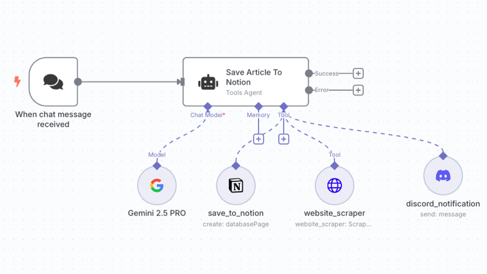

# 🧠 Save Article To Notion — AI Automation Workflow  

An AI-powered automation that **saves, summarizes, and organizes content** on complete autopilot.  
Built by **Piyush AI Automation 🤖**

---

## 🖼️ Workflow Preview  

Here’s how this automation works behind the scenes 👇  

---

## 🚀 Overview  

This workflow listens for new chat messages, extracts useful article links, and automatically saves summarized content into **Notion** — while also sending instant **Discord notifications**.

Everything runs 100% automated — no manual work needed ⚙️  

---

## ⚙️ Workflow Steps  

1️⃣ **Trigger:**  
When a new chat message is received.  

2️⃣ **AI Model:**  
Uses **Gemini 2.5 Pro** to summarize and clean up the article text.  

3️⃣ **Save to Notion:**  
Automatically creates a new Notion database page with the summary, title, and link.  

4️⃣ **Scrape Website:**  
Grabs article metadata using a web scraper tool.  

5️⃣ **Notify via Discord:**  
Sends a Discord message alert once a new article is added.  

---

## 🧩 Tools Used  

- 🧠 **Gemini 2.5 PRO** — AI text model  
- 🗒️ **Notion API** — for saving articles  
- 🌐 **Website Scraper** — for fetching web data  
- 💬 **Discord Webhook** — for real-time notifications  
- 🧰 **Make.com / Tools Agent** — automation backbone  

---

## 📁 Project Files  

| File | Description |
|------|--------------|
| `workflow.json` | Contains the AI automation flow setup |
| `workflow.png` | Visual diagram of the automation |
| `README.md` | Project documentation (this file) |

---

## 🧑‍💻 Setup Guide  

1. Clone this repo  
2. Import `workflow.json` into your **Make.com** account  
3. Connect APIs for Notion, Discord, and your chosen AI model  
4. Run the workflow and watch the automation in action 🚀  

---

## 💡 Example Use Case  

Whenever someone sends you a chat message with an article link —  
the AI summarizes it, saves it to your Notion knowledge base,  
and instantly notifies your Discord channel ⚡  

---

## 🔗 Connect With Me  

Built by **Piyush AI Automation 🤖**  
[LinkedIn — @piyush2707](https://linkedin.com/in/piyush2707)

---

> ⚙️ *Automate Smart. Work Less.*
